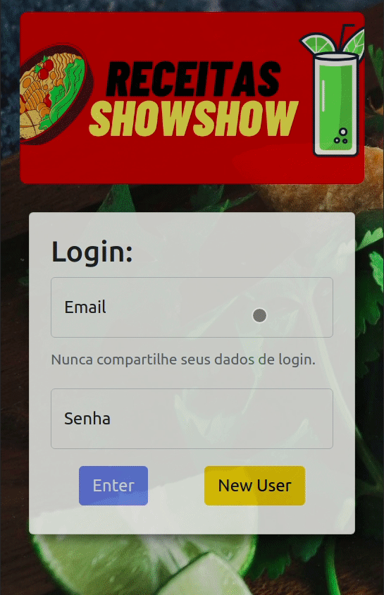
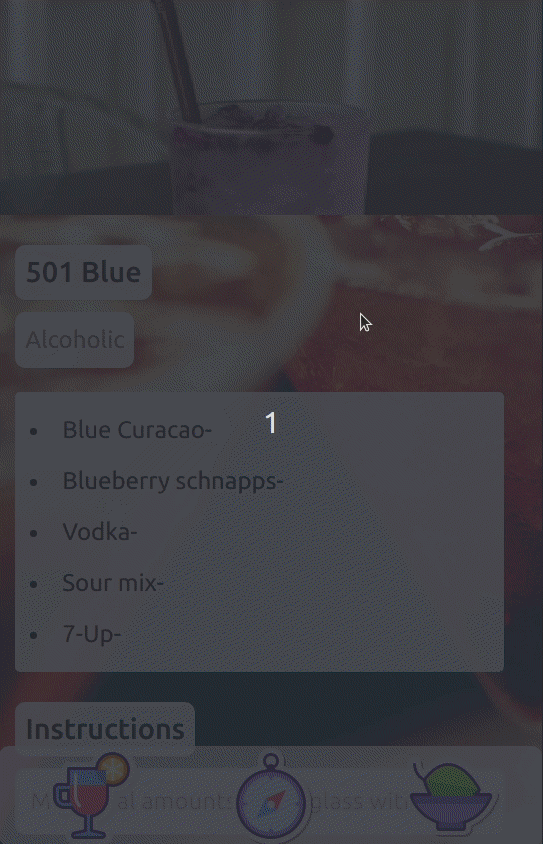
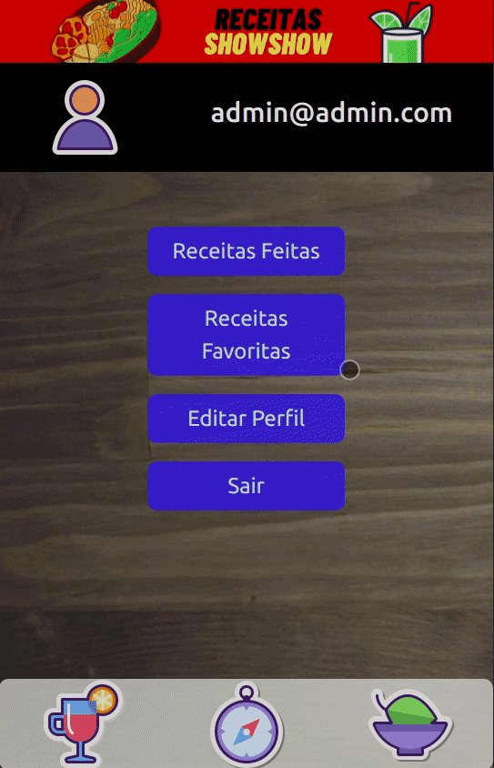
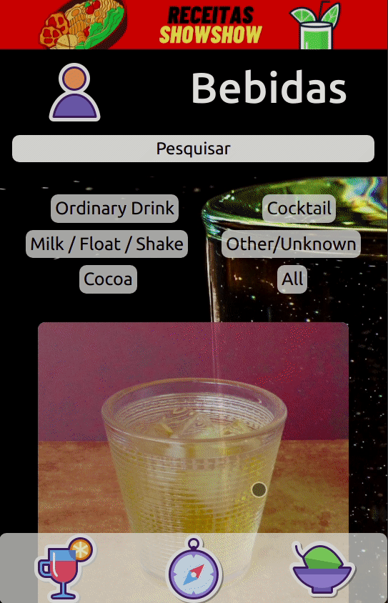
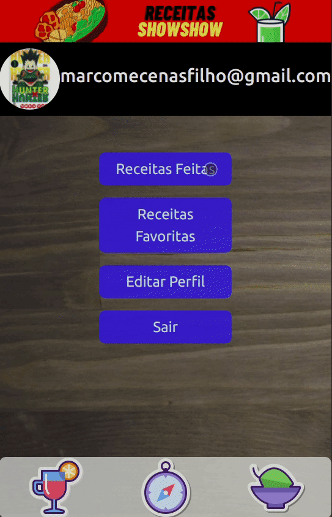

<h1 align="center">Receitas ShowShow</h1>
<h4 align="center"> 
	🚧  Receitas ShowShow 🚀 Finalizado  🚧
</h4>
<br>
<h2>Sobre</h2>
<p align="justify"> Receitas ShowShow- É uma App de receitas desenvolvida para a que o usuário possa fazer receitas incríveis de uma maneira bem prática. Nele podemos favoritas receitas, iniciar uma receita e marcando cada passo que é feito. Podendo pausar o quando quiser e continuar posteriormente. Temos páginas das suas receitas favoritas e das já concluidas. O usuário pode editar seu parfil, colocando sua fot. O aplicativo possue um menu de busca muito completo. Onde se pode procurar por ingrediente, nome e primeira letra. E caso você não saiba muito bom o que deseja cozinhar. Pode ir para a página de explorar. Onde pode procurar as receitas atráves de ingredientes, locais ou de forma randômica. 

Vamos entrar nessa aventura gastrônomia de pratos deleciosos ? </p>

### Features

-  Cadastro de usuário
-  Edição de usuário
-  Cadastro de receitas favoritas
-  Iniciar receitas
-  Sistema de passo a passo de receitas
-  Continuar receitas já iniciadas
-  Sistema de buscas muito completo
-  Compartilhar as receitas
-  Páginas de receitas favoritas e completas
<br>
## 🛠 Tecnologias

As seguintes ferramentas foram utilizadas na construção do projeto:

- [React](https://pt-br.reactjs.org/)
- [JavaScript](https://developer.mozilla.org/en-US/docs/Web/JavaScript/Language_Resources)
- [React-BootStrap](https://react-bootstrap.github.io/)
- [Node.js](https://nodejs.org/en/)
- [API-COMIDAS](https://www.themealdb.com/api.php)
- [API-BEBIDAS](https://www.thecocktaildb.com/api.php)


<h2>Testar o projeto</h2>
<h4>Clique na imagem abaixo</h4>
<br>
<div align="center">
<a  href="https://receitasshoshow.herokuapp.com/" target="_blank"></a> 
</div>
<br>
<h2>Instalar o projeto em sua máquina</h2>
<br>
<h3>Pré-requisitos</h3>

Antes de começar, você vai precisar ter instalado em sua máquina as seguintes ferramentas:
[Git](https://git-scm.com) e [Node.js](https://nodejs.org/en/). É necessário a utilização de um editor de código, e como recomendação deixo o [VSCode](https://code.visualstudio.com/).


###  Rodando a aplicação web.

```bash
# Clone este repositório
# Aqui usamos o SSH
$ git clone git@github.com:MarcoMecenasFilho/receitasshowshow.git

# Acesse a pasta do projeto no seu terminal/cmd
$ cd receitasshowshow

# Instale as dependências
$ npm install

# Execute a aplicação em modo de desenvolvimento
$ npm run dev

# A aplicação será aberta na porta:3000 - acesse http://localhost:3000
```
<h2>Utilizando a aplicação</h2>
<p align="justify">A tela inicial da aplicação é a página de login. Onde você adiciona seus dados e entra na página de receitas . Não existe servidores. Então todo o sistema de autenticação é simulado utilizando o localStore. E nenhuma informação é realmente enviada para algum lugar. E caso você não tenha um login, ou tenha esquecido. É só criar um novo usuário.</p>

<br>
<p align="justify">Para criar um novo usuário, basta clicar no botão, e adicionar um email qualquer com formato valido(@ e .com) e uma senha que seja maior que 6 caracteres. Lembrando que não existe backEnd. Todo o sistema de login é uma simulação. Recomendo a utilização de dados fictícios. </p>

<br>
<p align="justify">Quando efetuamos o Login, somos enviados para a página Inicial. Onde já existem algumas receitas que podemos clicar, ou utilizamos a barra de busca, onde podemos pesquisar por ingrediente, primeira letra e nome da receita ( É necessário que os termos da busca estejam em inglês, devido as APIs utilizadas). Existem filtros onde podemos selecionar categorias. Existem o cabeçalho onde podemos ir até nosso perfil e por fim uma barra no fim da página, onde podemos ir para a página de explorar, a página de bebidas ou voltar para a página de comidas, onde já estamos</p>

<br>

<p align="justify"> Quando clicamos no icones de
bebidas, somos enviados para a página de bebidas. Tendo as mesmas características da página anterior</p>

<br>

<p align="justify"> Quando clicamos nos cards de comida ou bebida, somos enviados para a página de detalhes, onde temos mais informações sobre aquela receita. Como ingredientes, instruções e medidas. Caso aquela receita tenha sido iniciar, aparecera um botão iniciar receita. Caso a receita já tenha iniciada aparecerá o botão continuar receita, mas caso a receita já tenha sido finalizada nenhum botão ficará visível.
Existem 3 botões no fim das instruções. Sendo eles o de favoritar aquela receita, o de perfil e  o de compartilhar aquela receita. Quando clicado ele copia o endereço para que possa colar em qualquer aplicativo de mensagem. No fim da página exitse uma área de recomendados, que são receitas complementares para a receita da página atual.
</p>

<br>

<p align="justify"> A página de detalhes de comidas é quase identica a de bebidas. Possue apenas a diferença de ter um video explicando de como preparar aquele prato. </p>


<br>

<p align="justify"> Quando iniciamos ou continuamos uma receita, somo enviados para a página de progresso. Onde podemos seguir passo a passo do prepraro, quando finalizamos aquele aquela etapo podemos marcar e deixar riscado o que já foi feito. Quando completamos a receita o botão de finalizar é ativado. Quando clicamos, aquela receita é finalizada. Aqui também existem os botões de favoritos, compartilhar e de perfil. </p>


<br>

<p align="justify"> A página de progresso de comida possue aa mesmas características da página anterior. </p>


<br>

<p align="justify"> Para acessar a página de peril, basta clicar no icone ou na imagem escolhida pelo usuário (será ensinado posteriormente a adicionar a foto). Ná página podemos acessar as páginas de fávoritos, receitas feitas, editar o perfil e sair.</p>


<br>

<p align="justify">A página de receitas feitas possue filtros, que podemos selecionar comida ou bebida. Caso queira ver detalhes daquela receita, basta clicar no card. Clicando no icone do card é possível refazer aquela receita.</p>


<br>

<p align="justify">A página de receitas favoritas possue filtros, que podemos selecionar comida ou bebida. Caso queira ver detalhes daquela receita, basta clicar no card. Clicando no icone do card é possível excluir aquela receita dos favoritos.</p>


<br>

<p align="justify">Para acessar a página de explorar, basta clicar no icone do meio da barra inferior. Podendo escolher explorar comidas ou bebidas</p>


<br>

<p align="justify">A página explorar comida, existem 3 categorias. Sendo explorar por ingredientes, por local e por fim de forma randômica</p>


<br>

<p align="justify">A página explorar bebida, existem duas categorias. Sendo explorar por ingredientes e de forma randômica</p>


<br>

<p align="justify">Para acessar a página de editar perfil, basta clicar no botão na página de perfil. Onde podemos trocar ou colocar a mesma senha e email, e adicionar uma url de imagem, assim o icone de perfil, será trocado pela foto que o usuário preferir</p>


<br>

<p align="justify">Quando clicamos em sair ná página de login, todos os nossos dados de acesso  e receitas são apagados e somos enviados para a página de login. Sendo necessário criar um novo usuário.</p>


<br>

## 📝 Licença

Este projeto foi feito com muita dedicação e carinho por Marco Mecenas  [Entre em contato!](https://www.linkedin.com/in/marcomecenasfilho/)
<p align="justify">Foi utilizado o projeto Trybe-Wallet como inspiração.  Sendo ele desenvolvido durante minha formação de desenvolvedor web FullStack na <a href="https://www.betrybe.com/" target="_blank">Trybe</a>.</p>
